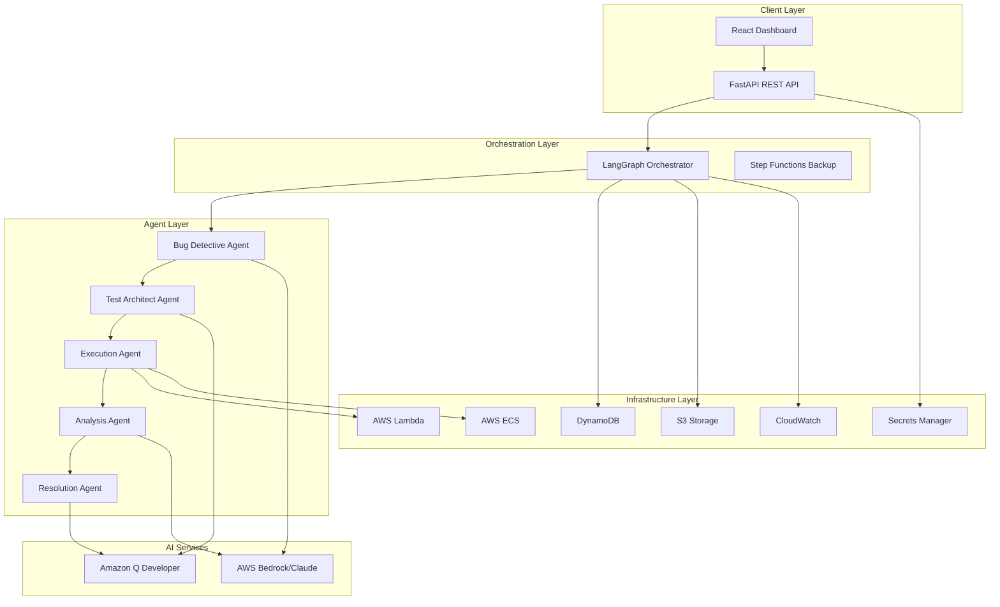
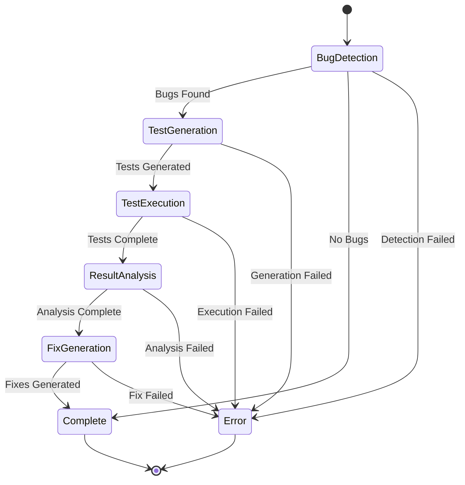

# Design Document: CloudForge Bug Intelligence

## Overview

CloudForge Bug Intelligence is a multi-agent system built on AWS that automates the complete bug lifecycle. The architecture employs five specialized AI agents orchestrated through LangGraph, each responsible for a distinct phase: detection, test generation, execution, analysis, and resolution. The system is designed for cost-effectiveness (targeting <$100/month for demos), scalability, and enterprise-grade reliability.

The platform uses a state machine pattern where each agent receives shared state, performs its specialized task, and passes enriched state to the next agent. AWS services provide the infrastructure backbone: Bedrock for AI capabilities, Lambda/ECS for compute, DynamoDB for state persistence, S3 for artifact storage, and Step Functions for workflow orchestration fallback.

## Architecture

### High-Level Architecture



### Agent Workflow State Machine



### Deployment Architecture

The system deploys across multiple AWS services:

- **API Gateway + Lambda**: Hosts the FastAPI application for REST endpoints
- **ECS Fargate**: Runs the LangGraph orchestrator as a long-running service
- **Lambda Functions**: Execute short-duration agent tasks and test execution
- **ECS Tasks**: Execute long-running test suites that exceed Lambda limits
- **DynamoDB**: Stores workflow state, bug reports, and metadata
- **S3**: Stores code repositories, test artifacts, and analysis reports
- **CloudWatch**: Centralized logging and monitoring
- **Secrets Manager**: Stores API keys and credentials

## Components and Interfaces

### 1. Agent State Schema

The shared state object passed between agents:

```python
from typing import List, Dict, Optional, Literal
from pydantic import BaseModel, Field
from datetime import datetime

class BugReport(BaseModel):
    bug_id: str
    file_path: str
    line_number: int
    severity: Literal["critical", "high", "medium", "low"]
    description: str
    code_snippet: str
    confidence_score: float = Field(ge=0.0, le=1.0)

class TestCase(BaseModel):
    test_id: str
    bug_id: str
    test_code: str
    test_framework: str
    expected_outcome: str

class TestResult(BaseModel):
    test_id: str
    status: Literal["passed", "failed", "error", "skipped"]
    stdout: str
    stderr: str
    exit_code: int
    execution_time_ms: int
    execution_platform: Literal["lambda", "ecs"]

class RootCause(BaseModel):
    bug_id: str
    cause_description: str
    related_bugs: List[str]
    confidence_score: float = Field(ge=0.0, le=1.0)

class FixSuggestion(BaseModel):
    bug_id: str
    fix_description: str
    code_diff: str
    safety_score: float = Field(ge=0.0, le=1.0)
    impact_assessment: str

class AgentState(BaseModel):
    workflow_id: str
    repository_url: str
    repository_path: str
    current_agent: str
    status: Literal["pending", "in_progress", "completed", "failed"]
    created_at: datetime
    updated_at: datetime
    
    # Agent outputs
    bugs: List[BugReport] = []
    test_cases: List[TestCase] = []
    test_results: List[TestResult] = []
    root_causes: List[RootCause] = []
    fix_suggestions: List[FixSuggestion] = []
    
    # Error tracking
    errors: List[Dict[str, str]] = []
    retry_count: int = 0
```

### 2. Bug Detective Agent

**Responsibility**: Scan code repositories for potential bugs using AI-powered pattern recognition.

**Interface**:
```python
class BugDetectiveAgent:
    def __init__(self, bedrock_client, config: DetectionConfig):
        self.bedrock_client = bedrock_client
        self.config = config
        self.logger = logging.getLogger(__name__)
    
    async def detect_bugs(self, state: AgentState) -> AgentState:
        """
        Scan repository and detect bugs.
        
        Args:
            state: Current workflow state with repository_path
            
        Returns:
            Updated state with bugs list populated
        """
        pass
    
    async def _scan_file(self, file_path: str) -> List[BugReport]:
        """Scan a single file for bugs using Bedrock."""
        pass
    
    async def _batch_scan(self, file_paths: List[str]) -> List[BugReport]:
        """Scan multiple files in batches to manage API costs."""
        pass
```

**Implementation Details**:
- Uses AWS Bedrock with Claude 3 Sonnet for code analysis
- Implements batching for repositories >10,000 files
- Applies exponential backoff with max 3 retries
- Classifies bugs by severity using prompt engineering
- Extracts code snippets with surrounding context (±5 lines)

### 3. Test Architect Agent

**Responsibility**: Generate executable test cases for detected bugs.

**Interface**:
```python
class TestArchitectAgent:
    def __init__(self, q_developer_client, config: TestConfig):
        self.q_developer_client = q_developer_client
        self.config = config
        self.logger = logging.getLogger(__name__)
    
    async def generate_tests(self, state: AgentState) -> AgentState:
        """
        Generate test cases for all detected bugs.
        
        Args:
            state: Current workflow state with bugs list
            
        Returns:
            Updated state with test_cases list populated
        """
        pass
    
    async def _generate_test_for_bug(self, bug: BugReport, repo_context: str) -> TestCase:
        """Generate a single test case using Q Developer."""
        pass
    
    def _detect_test_framework(self, repository_path: str) -> str:
        """Detect the testing framework used in the repository."""
        pass
```

**Implementation Details**:
- Uses Amazon Q Developer API for test generation
- Detects test framework from repository (pytest, unittest, jest, etc.)
- Generates both positive and negative test scenarios
- Includes setup/teardown code when needed
- Flags bugs without clear test strategies for manual review

### 4. Execution Agent

**Responsibility**: Execute generated tests on AWS compute infrastructure.

**Interface**:
```python
class ExecutionAgent:
    def __init__(self, lambda_client, ecs_client, config: ExecutionConfig):
        self.lambda_client = lambda_client
        self.ecs_client = ecs_client
        self.config = config
        self.logger = logging.getLogger(__name__)
    
    async def execute_tests(self, state: AgentState) -> AgentState:
        """
        Execute all test cases on appropriate compute platform.
        
        Args:
            state: Current workflow state with test_cases list
            
        Returns:
            Updated state with test_results list populated
        """
        pass
    
    async def _execute_on_lambda(self, test: TestCase) -> TestResult:
        """Execute test on AWS Lambda."""
        pass
    
    async def _execute_on_ecs(self, test: TestCase) -> TestResult:
        """Execute test on AWS ECS."""
        pass
    
    def _estimate_resources(self, test: TestCase) -> Dict[str, int]:
        """Estimate memory and time requirements for a test."""
        pass
```

**Implementation Details**:
- Routes tests to Lambda (<15min, <10GB) or ECS (>15min or >10GB)
- Captures stdout, stderr, and exit codes
- Stores results in DynamoDB with timestamps
- Implements retry logic for infrastructure failures
- Uses alternate compute service if primary fails

### 5. Analysis Agent

**Responsibility**: Analyze test results and identify root causes.

**Interface**:
```python
class AnalysisAgent:
    def __init__(self, bedrock_client, config: AnalysisConfig):
        self.bedrock_client = bedrock_client
        self.config = config
        self.logger = logging.getLogger(__name__)
    
    async def analyze_results(self, state: AgentState) -> AgentState:
        """
        Analyze test results and identify root causes.
        
        Args:
            state: Current workflow state with test_results list
            
        Returns:
            Updated state with root_causes list populated
        """
        pass
    
    async def _analyze_failure(self, test_result: TestResult, bug: BugReport) -> RootCause:
        """Analyze a single test failure using Bedrock."""
        pass
    
    def _group_related_bugs(self, root_causes: List[RootCause]) -> List[RootCause]:
        """Group bugs with similar root causes."""
        pass
```

**Implementation Details**:
- Uses AWS Bedrock for causal analysis
- Correlates test failures with code patterns
- Groups bugs with shared root causes
- Provides confidence scores for each hypothesis
- Generates structured causal chains

### 6. Resolution Agent

**Responsibility**: Generate fix suggestions and code patches.

**Interface**:
```python
class ResolutionAgent:
    def __init__(self, q_developer_client, config: ResolutionConfig):
        self.q_developer_client = q_developer_client
        self.config = config
        self.logger = logging.getLogger(__name__)
    
    async def generate_fixes(self, state: AgentState) -> AgentState:
        """
        Generate fix suggestions for all root causes.
        
        Args:
            state: Current workflow state with root_causes list
            
        Returns:
            Updated state with fix_suggestions list populated
        """
        pass
    
    async def _generate_fix(self, root_cause: RootCause, bug: BugReport) -> FixSuggestion:
        """Generate a fix suggestion using Q Developer."""
        pass
    
    def _rank_fixes(self, fixes: List[FixSuggestion]) -> List[FixSuggestion]:
        """Rank fixes by safety and impact scores."""
        pass
```

**Implementation Details**:
- Uses Amazon Q Developer for fix generation
- Maintains code style consistency with repository
- Generates unified diff format patches
- Ranks multiple fix strategies by safety/impact
- Provides before/after code comparisons

### 7. LangGraph Orchestrator

**Responsibility**: Coordinate agent execution and manage workflow state.

**Interface**:
```python
from langgraph.graph import StateGraph, END

class WorkflowOrchestrator:
    def __init__(self, agents: Dict[str, Any], state_store: StateStore):
        self.agents = agents
        self.state_store = state_store
        self.graph = self._build_graph()
        self.logger = logging.getLogger(__name__)
    
    def _build_graph(self) -> StateGraph:
        """Build the LangGraph workflow."""
        workflow = StateGraph(AgentState)
        
        # Add nodes
        workflow.add_node("detect", self.agents["detective"].detect_bugs)
        workflow.add_node("generate_tests", self.agents["architect"].generate_tests)
        workflow.add_node("execute_tests", self.agents["executor"].execute_tests)
        workflow.add_node("analyze", self.agents["analyzer"].analyze_results)
        workflow.add_node("resolve", self.agents["resolver"].generate_fixes)
        
        # Add edges
        workflow.set_entry_point("detect")
        workflow.add_edge("detect", "generate_tests")
        workflow.add_edge("generate_tests", "execute_tests")
        workflow.add_edge("execute_tests", "analyze")
        workflow.add_edge("analyze", "resolve")
        workflow.add_edge("resolve", END)
        
        # Add conditional edges for error handling
        workflow.add_conditional_edges(
            "detect",
            self._should_continue,
            {True: "generate_tests", False: END}
        )
        
        return workflow.compile()
    
    async def execute_workflow(self, workflow_id: str, repository_url: str) -> AgentState:
        """Execute the complete bug lifecycle workflow."""
        pass
    
    def _should_continue(self, state: AgentState) -> bool:
        """Determine if workflow should continue based on state."""
        pass
```

**Implementation Details**:
- Uses LangGraph for state machine orchestration
- Persists state to DynamoDB after each agent
- Implements retry logic with exponential backoff
- Supports parallel execution where possible
- Generates summary reports on completion

### 8. State Store

**Responsibility**: Persist and retrieve workflow state from DynamoDB.

**Interface**:
```python
class StateStore:
    def __init__(self, dynamodb_client, table_name: str):
        self.dynamodb = dynamodb_client
        self.table_name = table_name
        self.logger = logging.getLogger(__name__)
    
    async def save_state(self, state: AgentState) -> None:
        """Save workflow state to DynamoDB."""
        pass
    
    async def load_state(self, workflow_id: str) -> Optional[AgentState]:
        """Load workflow state from DynamoDB."""
        pass
    
    async def query_workflows(self, filters: Dict[str, Any]) -> List[AgentState]:
        """Query workflows with filters."""
        pass
```

**Implementation Details**:
- Uses DynamoDB with workflow_id as partition key
- Implements optimistic locking with version numbers
- Supports querying by status, date, severity
- Implements pagination for large result sets

### 9. FastAPI REST API

**Responsibility**: Provide RESTful endpoints for workflow management.

**Interface**:
```python
from fastapi import FastAPI, HTTPException, Depends
from pydantic import BaseModel

app = FastAPI(title="CloudForge Bug Intelligence API")

class WorkflowCreateRequest(BaseModel):
    repository_url: str
    branch: Optional[str] = "main"

class WorkflowResponse(BaseModel):
    workflow_id: str
    status: str
    created_at: datetime
    bugs_found: int
    tests_generated: int

@app.post("/workflows", response_model=WorkflowResponse)
async def create_workflow(request: WorkflowCreateRequest):
    """Create a new bug detection workflow."""
    pass

@app.get("/workflows/{workflow_id}", response_model=AgentState)
async def get_workflow(workflow_id: str):
    """Get workflow status and results."""
    pass

@app.get("/workflows", response_model=List[WorkflowResponse])
async def list_workflows(
    status: Optional[str] = None,
    severity: Optional[str] = None,
    limit: int = 50,
    offset: int = 0
):
    """List workflows with optional filters."""
    pass

@app.get("/workflows/{workflow_id}/bugs", response_model=List[BugReport])
async def get_bugs(workflow_id: str):
    """Get all bugs for a workflow."""
    pass

@app.get("/workflows/{workflow_id}/fixes", response_model=List[FixSuggestion])
async def get_fixes(workflow_id: str):
    """Get all fix suggestions for a workflow."""
    pass
```

**Implementation Details**:
- Uses Pydantic for request/response validation
- Implements rate limiting with slowapi
- Provides OpenAPI docs at /docs
- Returns standard HTTP status codes
- Implements authentication with API keys

### 10. React Dashboard

**Responsibility**: Provide web interface for workflow monitoring.

**Component Structure**:
```
src/
├── components/
│   ├── WorkflowList.tsx       # List of all workflows
│   ├── WorkflowDetail.tsx     # Detailed workflow view
│   ├── BugCard.tsx            # Individual bug display
│   ├── TestResults.tsx        # Test execution results
│   ├── FixSuggestion.tsx      # Fix suggestion display
│   └── StatusIndicator.tsx    # Agent status indicators
├── hooks/
│   ├── useWorkflows.ts        # Fetch workflows from API
│   ├── useWorkflowDetail.ts   # Fetch workflow details
│   └── usePolling.ts          # Auto-refresh for active workflows
├── services/
│   └── api.ts                 # API client
└── App.tsx                    # Main application
```

**Key Features**:
- Real-time workflow status updates using polling
- Filterable workflow list (status, date, severity)
- Drill-down views for bugs, tests, and fixes
- Code diff visualization for fix suggestions
- Responsive design for mobile/desktop

## Data Models

### DynamoDB Tables

**Workflows Table**:
```
Table: cloudforge-workflows
Partition Key: workflow_id (String)
Sort Key: updated_at (Number, timestamp)

Attributes:
- workflow_id: String
- repository_url: String
- status: String
- current_agent: String
- created_at: Number
- updated_at: Number
- state_json: String (serialized AgentState)

GSI: status-index
- Partition Key: status
- Sort Key: created_at
```

**Bugs Table**:
```
Table: cloudforge-bugs
Partition Key: workflow_id (String)
Sort Key: bug_id (String)

Attributes:
- workflow_id: String
- bug_id: String
- file_path: String
- severity: String
- description: String
- code_snippet: String
- confidence_score: Number

GSI: severity-index
- Partition Key: severity
- Sort Key: workflow_id
```

### S3 Bucket Structure

```
cloudforge-artifacts/
├── repositories/
│   └── {workflow_id}/
│       └── {repository_files}
├── test-results/
│   └── {workflow_id}/
│       └── {test_id}.json
├── analysis-reports/
│   └── {workflow_id}/
│       └── analysis.json
└── fix-patches/
    └── {workflow_id}/
        └── {bug_id}.patch
```

### Configuration Schema

```python
class SystemConfig(BaseModel):
    # AWS Configuration
    aws_region: str = "us-east-1"
    bedrock_model_id: str = "anthropic.claude-3-sonnet-20240229-v1:0"
    
    # Cost Management
    max_monthly_cost: float = 100.0
    api_rate_limit_per_minute: int = 60
    
    # Agent Configuration
    max_retries: int = 3
    retry_backoff_base: float = 2.0
    max_files_per_batch: int = 100
    
    # Execution Configuration
    lambda_timeout_seconds: int = 900  # 15 minutes
    lambda_memory_mb: int = 10240  # 10 GB
    ecs_cpu: int = 2048
    ecs_memory_mb: int = 16384
    
    # Storage Configuration
    data_retention_days: int = 90
    s3_lifecycle_archive_days: int = 30
```


## Correctness Properties

*A property is a characteristic or behavior that should hold true across all valid executions of a system—essentially, a formal statement about what the system should do. Properties serve as the bridge between human-readable specifications and machine-verifiable correctness guarantees.*

### Bug Detection Properties

**Property 1: Complete file scanning**
*For any* code repository provided to the Bug_Detective_Agent, all source files in the repository should be scanned for bug patterns.
**Validates: Requirements 1.1**

**Property 2: Bedrock integration**
*For any* code file being scanned, the Bug_Detective_Agent should invoke AWS Bedrock with Claude using the configured model ID and region.
**Validates: Requirements 1.2**

**Property 3: Severity classification completeness**
*For any* bug detected by the Bug_Detective_Agent, the bug should be classified with exactly one severity level from {critical, high, medium, low}.
**Validates: Requirements 1.3**

**Property 4: Bug report structure**
*For any* completed scan, all bug reports should contain file_path, line_number, severity, description, code_snippet, and confidence_score fields.
**Validates: Requirements 1.4**

**Property 5: Exponential backoff retry**
*For any* API call that fails, the Bug_Detective_Agent should retry with exponentially increasing delays (base 2.0) for a maximum of 3 attempts.
**Validates: Requirements 1.6**

### Test Generation Properties

**Property 6: Test case generation completeness**
*For any* set of detected bugs, the Test_Architect_Agent should generate at least one test case for each bug.
**Validates: Requirements 2.1**

**Property 7: Q Developer integration**
*For any* test case being generated, the Test_Architect_Agent should invoke Amazon Q Developer API with the configured endpoint.
**Validates: Requirements 2.2**

**Property 8: Test scenario coverage**
*For any* generated test case, the test code should include both positive (expected behavior) and negative (error handling) test scenarios.
**Validates: Requirements 2.3**

**Property 9: Test framework compatibility**
*For any* generated test code, the code should be syntactically valid for the detected testing framework of the repository.
**Validates: Requirements 2.4**

**Property 10: Error resilience in test generation**
*For any* test generation failure, the Test_Architect_Agent should log the error and continue processing remaining bugs without stopping the workflow.
**Validates: Requirements 2.6**

### Test Execution Properties

**Property 11: Resource-based routing**
*For any* test case, the Execution_Agent should route it to AWS Lambda if estimated runtime < 15 minutes AND memory < 10GB, otherwise to AWS ECS.
**Validates: Requirements 3.1, 3.2, 3.3**

**Property 12: Test output capture**
*For any* executed test, the test result should contain stdout, stderr, exit_code, execution_time_ms, and execution_platform fields.
**Validates: Requirements 3.4**

**Property 13: Result persistence**
*For any* completed test execution, a corresponding entry should exist in DynamoDB with a timestamp within 1 second of completion.
**Validates: Requirements 3.5**

**Property 14: Infrastructure failover**
*For any* test execution that fails due to infrastructure errors (not test failures), the Execution_Agent should retry on the alternate compute service (Lambda ↔ ECS).
**Validates: Requirements 3.6**

### Analysis Properties

**Property 15: Complete result processing**
*For any* set of test results, the Analysis_Agent should process all test outputs and generate analysis for each failed test.
**Validates: Requirements 4.1**

**Property 16: Bedrock analysis integration**
*For any* failed test result, the Analysis_Agent should invoke AWS Bedrock to identify root causes.
**Validates: Requirements 4.2**

**Property 17: Code pattern correlation**
*For any* identified root cause, the root cause should reference specific code patterns or structures from the repository.
**Validates: Requirements 4.3**

**Property 18: Causal chain structure**
*For any* completed analysis, the report should contain structured causal chains linking bugs to root causes.
**Validates: Requirements 4.4**

**Property 19: Bug grouping by root cause**
*For any* set of bugs with identical root cause descriptions, the Analysis_Agent should group them together in the related_bugs field.
**Validates: Requirements 4.5**

**Property 20: Confidence scoring**
*For any* root cause hypothesis, the hypothesis should include a confidence_score between 0.0 and 1.0.
**Validates: Requirements 4.6**

### Fix Generation Properties

**Property 21: Fix generation completeness**
*For any* identified root cause, the Resolution_Agent should generate at least one fix suggestion.
**Validates: Requirements 5.1**

**Property 22: Q Developer fix integration**
*For any* fix being generated, the Resolution_Agent should invoke Amazon Q Developer API to create code patches.
**Validates: Requirements 5.2**

**Property 23: Code style consistency**
*For any* generated code patch, the patch should follow the same indentation, naming conventions, and formatting as the surrounding code in the repository.
**Validates: Requirements 5.3**

**Property 24: Diff format completeness**
*For any* generated fix, the fix_suggestion should include a code_diff field with before and after code sections.
**Validates: Requirements 5.4**

**Property 25: Fix ranking**
*For any* bug with multiple fix suggestions, the fixes should be ranked in descending order by safety_score, with ties broken by impact_assessment.
**Validates: Requirements 5.5**

**Property 26: Unified diff format**
*For any* generated code_diff, the diff should be valid unified diff format parseable by standard diff tools.
**Validates: Requirements 5.6**

### Orchestration Properties

**Property 27: State passing between agents**
*For any* agent completion in the workflow, the Agent_State should be passed to the next agent with all previous agent outputs preserved.
**Validates: Requirements 6.2**

**Property 28: State persistence**
*For any* agent execution, the Agent_State should be saved to DynamoDB before and after the agent runs.
**Validates: Requirements 6.3**

**Property 29: Agent retry logic**
*For any* agent failure, the System should retry the agent execution with exponential backoff before proceeding to the next agent or failing the workflow.
**Validates: Requirements 6.4**

**Property 30: Workflow summary generation**
*For any* completed workflow, the System should generate a summary report containing counts of bugs found, tests generated, tests passed/failed, and fixes suggested.
**Validates: Requirements 6.5**

**Property 31: Parallel agent execution**
*For any* set of independent agents (agents not dependent on each other's outputs), the System should execute them concurrently when possible.
**Validates: Requirements 6.6**

### Infrastructure Properties

**Property 32: Infrastructure completeness**
*For any* deployment, the Deployment_Orchestrator should provision all required AWS resources: Lambda functions, ECS clusters, DynamoDB tables, S3 buckets, and CloudWatch log groups.
**Validates: Requirements 7.2**

**Property 33: IAM least privilege**
*For any* AWS resource, the associated IAM policy should grant only the minimum permissions required for that resource's function.
**Validates: Requirements 7.3**

**Property 34: Encryption configuration**
*For any* data storage resource (DynamoDB, S3), encryption at rest should be enabled using AWS KMS, and all network communication should use TLS 1.2 or higher.
**Validates: Requirements 7.4**

**Property 35: CloudWatch logging configuration**
*For any* AWS service deployed, a corresponding CloudWatch log group should be configured with structured JSON logging.
**Validates: Requirements 7.5**

### Cost Management Properties

**Property 36: API rate limiting**
*For any* time window of 1 minute, the System should make no more than the configured api_rate_limit_per_minute API calls to external services.
**Validates: Requirements 8.2**

**Property 37: Cost metric publishing**
*For any* API call or compute execution, the System should publish cost-related metrics (API call count, execution duration) to CloudWatch.
**Validates: Requirements 8.5**

**Property 38: Cost alert triggering**
*For any* cost metric that exceeds 80% of the Cost_Budget, the System should send an SNS notification to administrators.
**Validates: Requirements 8.6**

### Logging and Monitoring Properties

**Property 39: Structured JSON logging**
*For any* agent action logged to CloudWatch, the log entry should be valid JSON containing timestamp, agent_name, action, and status fields.
**Validates: Requirements 9.1**

**Property 40: Error logging completeness**
*For any* error that occurs, the log entry should contain a stack trace and context information (workflow_id, agent_name, input_state).
**Validates: Requirements 9.2**

**Property 41: Agent metrics publishing**
*For any* agent execution, the System should publish custom CloudWatch metrics for execution_time_ms and success/failure status.
**Validates: Requirements 9.3**

**Property 42: Inter-agent communication logging**
*For any* state transition between agents, the System should log the complete Agent_State payload being passed.
**Validates: Requirements 9.4**

**Property 43: Critical error notifications**
*For any* critical error (workflow failure, agent crash, infrastructure failure), the System should trigger an SNS notification.
**Validates: Requirements 9.6**

### API Configuration Properties

**Property 44: Bedrock configuration flexibility**
*For any* Bedrock API call, the System should use the configured bedrock_model_id and aws_region from the SystemConfig.
**Validates: Requirements 10.2**

**Property 45: Q Developer configuration flexibility**
*For any* Q Developer API call, the System should use the configured API endpoint from the SystemConfig.
**Validates: Requirements 10.3**

**Property 46: Credential loading**
*For any* API requiring credentials, the System should successfully load credentials from either AWS Secrets Manager or environment variables.
**Validates: Requirements 10.4**

**Property 47: Startup configuration validation**
*For any* System startup, all API configurations should be validated before accepting workflow requests, and invalid configurations should cause immediate failure with descriptive error messages.
**Validates: Requirements 10.5, 10.6**

### Error Handling Properties

**Property 48: Exponential backoff for all APIs**
*For any* external API call (Bedrock, Q Developer, AWS services), failures should trigger exponential backoff retries with base 2.0 and max 3 attempts.
**Validates: Requirements 11.1**

**Property 49: Workflow continuation after retry exhaustion**
*For any* operation where retries are exhausted, the System should log the failure and continue processing remaining work items without stopping the entire workflow.
**Validates: Requirements 11.2**

**Property 50: Input validation**
*For any* API request or workflow input, the System should validate the input against the expected schema and reject invalid inputs before processing.
**Validates: Requirements 11.3**

**Property 51: Descriptive validation errors**
*For any* validation failure, the error message should describe which field failed validation and what the expected format is.
**Validates: Requirements 11.4**

**Property 52: Circuit breaker activation**
*For any* external service that fails more than 5 times in a 1-minute window, the System should open a circuit breaker and reject requests to that service for 30 seconds.
**Validates: Requirements 11.5**

**Property 53: Workflow state recovery**
*For any* agent crash or system restart, the System should recover the workflow state from DynamoDB and resume from the last successful agent.
**Validates: Requirements 11.6**

### Security Properties

**Property 54: Sensitive data sanitization**
*For any* log entry, the entry should not contain patterns matching API keys, passwords, or AWS credentials (checked via regex).
**Validates: Requirements 12.4**

### API Properties

**Property 55: Pydantic input validation**
*For any* API request, invalid input that doesn't match the Pydantic schema should be rejected with a 422 status code and validation error details.
**Validates: Requirements 14.2**

**Property 56: HTTP status code correctness**
*For any* API response, the HTTP status code should be 200 for success, 400 for client errors, 404 for not found, 422 for validation errors, and 500 for server errors.
**Validates: Requirements 14.4**

**Property 57: API rate limiting**
*For any* API client making more than 100 requests per minute, subsequent requests should receive 429 status code until the rate limit window resets.
**Validates: Requirements 14.5**

### Data Persistence Properties

**Property 58: Bug report persistence with timestamps**
*For any* bug report stored in DynamoDB, the entry should have an indexed timestamp field within 1 second of when the bug was detected.
**Validates: Requirements 15.1**

**Property 59: S3 path structure**
*For any* file stored in S3, the file path should follow the structure: {artifact_type}/{workflow_id}/{item_id}.{extension}.
**Validates: Requirements 15.2**

**Property 60: Query filtering**
*For any* query with filters (date_range, severity, status), the results should only include items matching all specified filters.
**Validates: Requirements 15.3**

**Property 61: Pagination support**
*For any* query returning more than 50 results, the response should include pagination metadata (total_count, offset, limit) and support offset-based pagination.
**Validates: Requirements 15.5**

**Property 62: Export format validity**
*For any* bug report export, the JSON export should be valid JSON parseable by standard parsers, and the CSV export should be valid CSV with headers.
**Validates: Requirements 15.6**

### UI Properties

**Property 63: Workflow filtering**
*For any* dashboard filter applied (status, date, severity), the displayed workflows should only include those matching the filter criteria.
**Validates: Requirements 13.5**


## Error Handling

### Error Categories

The system handles four categories of errors:

1. **Transient Errors**: Temporary failures that may succeed on retry
   - Network timeouts
   - API rate limits
   - Temporary service unavailability
   - **Strategy**: Exponential backoff with max 3 retries

2. **Permanent Errors**: Failures that won't succeed on retry
   - Invalid API credentials
   - Malformed input data
   - Resource not found
   - **Strategy**: Fail fast with descriptive error message

3. **Partial Failures**: Some items succeed, others fail
   - Batch processing where some files fail to scan
   - Multiple test executions with mixed results
   - **Strategy**: Log failures, continue with successful items

4. **Critical Failures**: System-level failures requiring intervention
   - Database connection loss
   - Infrastructure provisioning failure
   - Agent crash
   - **Strategy**: Trigger alerts, attempt state recovery

### Error Handling Patterns

**Exponential Backoff**:
```python
async def retry_with_backoff(
    func: Callable,
    max_retries: int = 3,
    base_delay: float = 2.0
) -> Any:
    """Retry function with exponential backoff."""
    for attempt in range(max_retries):
        try:
            return await func()
        except TransientError as e:
            if attempt == max_retries - 1:
                raise
            delay = base_delay ** attempt
            await asyncio.sleep(delay)
            logger.warning(f"Retry {attempt + 1}/{max_retries} after {delay}s")
```

**Circuit Breaker**:
```python
class CircuitBreaker:
    """Prevent cascading failures by breaking circuit after repeated failures."""
    
    def __init__(self, failure_threshold: int = 5, timeout: int = 30):
        self.failure_threshold = failure_threshold
        self.timeout = timeout
        self.failures = 0
        self.last_failure_time = None
        self.state = "closed"  # closed, open, half-open
    
    async def call(self, func: Callable) -> Any:
        if self.state == "open":
            if time.time() - self.last_failure_time > self.timeout:
                self.state = "half-open"
            else:
                raise CircuitBreakerOpenError()
        
        try:
            result = await func()
            if self.state == "half-open":
                self.state = "closed"
                self.failures = 0
            return result
        except Exception as e:
            self.failures += 1
            self.last_failure_time = time.time()
            if self.failures >= self.failure_threshold:
                self.state = "open"
            raise
```

**State Recovery**:
```python
async def recover_workflow(workflow_id: str) -> AgentState:
    """Recover workflow state after crash."""
    state = await state_store.load_state(workflow_id)
    if not state:
        raise WorkflowNotFoundError(workflow_id)
    
    # Determine which agent to resume from
    if state.status == "in_progress":
        logger.info(f"Recovering workflow {workflow_id} from agent {state.current_agent}")
        # Resume from current agent
        return state
    else:
        logger.info(f"Workflow {workflow_id} already in terminal state: {state.status}")
        return state
```

**Graceful Degradation**:
- If Bug Detective finds no bugs, skip remaining agents and return empty results
- If Test Architect can't generate tests for some bugs, flag them and continue with others
- If Execution Agent can't run tests on Lambda, fall back to ECS
- If Analysis Agent has low confidence, still provide best-effort root causes with scores

### Error Logging

All errors are logged with structured context:

```python
logger.error(
    "Agent execution failed",
    extra={
        "workflow_id": state.workflow_id,
        "agent_name": agent_name,
        "error_type": type(e).__name__,
        "error_message": str(e),
        "stack_trace": traceback.format_exc(),
        "state_snapshot": state.dict()
    }
)
```

## Testing Strategy

### Dual Testing Approach

The system requires both unit tests and property-based tests for comprehensive coverage:

- **Unit tests**: Verify specific examples, edge cases, and integration points
- **Property tests**: Verify universal properties across randomized inputs

### Property-Based Testing

**Framework**: Use `hypothesis` for Python and `fast-check` for TypeScript

**Configuration**:
- Minimum 100 iterations per property test
- Each test tagged with: `Feature: cloudforge-bug-intelligence, Property {N}: {property_text}`
- Custom generators for domain objects (BugReport, TestCase, AgentState)

**Example Property Test**:
```python
from hypothesis import given, strategies as st
import pytest

@given(
    bugs=st.lists(
        st.builds(
            BugReport,
            bug_id=st.uuids().map(str),
            file_path=st.text(min_size=1),
            line_number=st.integers(min_value=1),
            severity=st.sampled_from(["critical", "high", "medium", "low"]),
            description=st.text(min_size=10),
            code_snippet=st.text(min_size=1),
            confidence_score=st.floats(min_value=0.0, max_value=1.0)
        ),
        min_size=1
    )
)
@pytest.mark.property_test
def test_property_6_test_generation_completeness(bugs):
    """
    Feature: cloudforge-bug-intelligence, Property 6: Test case generation completeness
    For any set of detected bugs, the Test_Architect_Agent should generate at least one test case for each bug.
    """
    # Arrange
    agent = TestArchitectAgent(mock_q_developer_client, config)
    state = AgentState(
        workflow_id="test-workflow",
        repository_url="https://example.com/repo",
        repository_path="/tmp/repo",
        current_agent="test_architect",
        status="in_progress",
        bugs=bugs
    )
    
    # Act
    result_state = await agent.generate_tests(state)
    
    # Assert
    bug_ids = {bug.bug_id for bug in bugs}
    test_bug_ids = {test.bug_id for test in result_state.test_cases}
    assert bug_ids == test_bug_ids, "Every bug should have at least one test case"
```

### Unit Testing

**Framework**: Use `pytest` for Python and `jest` for TypeScript

**Focus Areas**:
- Agent initialization and configuration
- API client mocking and integration
- State serialization/deserialization
- Error handling edge cases
- AWS service integration (using moto for mocking)

**Example Unit Test**:
```python
@pytest.mark.asyncio
async def test_bug_detective_handles_empty_repository():
    """Test that Bug Detective handles empty repositories gracefully."""
    # Arrange
    agent = BugDetectiveAgent(mock_bedrock_client, config)
    state = AgentState(
        workflow_id="test-workflow",
        repository_url="https://example.com/empty-repo",
        repository_path="/tmp/empty-repo",
        current_agent="bug_detective",
        status="in_progress"
    )
    
    # Act
    result_state = await agent.detect_bugs(state)
    
    # Assert
    assert len(result_state.bugs) == 0
    assert result_state.status == "completed"
    assert len(result_state.errors) == 0
```

### Integration Testing

**Scope**: Test agent interactions and workflow orchestration

**Approach**:
- Use LocalStack for local AWS service emulation
- Mock external AI services (Bedrock, Q Developer)
- Test complete workflows end-to-end
- Verify state persistence and recovery

**Example Integration Test**:
```python
@pytest.mark.integration
@pytest.mark.asyncio
async def test_complete_workflow_execution():
    """Test complete workflow from bug detection to fix generation."""
    # Arrange
    orchestrator = WorkflowOrchestrator(agents, state_store)
    repository_url = "https://github.com/example/test-repo"
    
    # Act
    final_state = await orchestrator.execute_workflow(
        workflow_id="integration-test",
        repository_url=repository_url
    )
    
    # Assert
    assert final_state.status == "completed"
    assert len(final_state.bugs) > 0
    assert len(final_state.test_cases) > 0
    assert len(final_state.test_results) > 0
    assert len(final_state.root_causes) > 0
    assert len(final_state.fix_suggestions) > 0
```

### Test Organization

```
tests/
├── unit/
│   ├── agents/
│   │   ├── test_bug_detective.py
│   │   ├── test_test_architect.py
│   │   ├── test_execution_agent.py
│   │   ├── test_analysis_agent.py
│   │   └── test_resolution_agent.py
│   ├── orchestration/
│   │   ├── test_langgraph_orchestrator.py
│   │   └── test_state_store.py
│   └── api/
│       ├── test_fastapi_endpoints.py
│       └── test_validation.py
├── property/
│   ├── test_bug_detection_properties.py
│   ├── test_test_generation_properties.py
│   ├── test_execution_properties.py
│   ├── test_analysis_properties.py
│   ├── test_resolution_properties.py
│   ├── test_orchestration_properties.py
│   └── test_api_properties.py
├── integration/
│   ├── test_workflow_execution.py
│   ├── test_state_persistence.py
│   └── test_error_recovery.py
└── conftest.py  # Shared fixtures and configuration
```

### Mocking Strategy

**External Services**:
- AWS Bedrock: Mock using `unittest.mock` with predefined responses
- Amazon Q Developer: Mock API client with test data
- AWS Services: Use `moto` for DynamoDB, S3, Lambda, ECS
- CloudWatch: Mock client to verify logging calls

**Test Data**:
- Maintain fixtures for sample repositories, bug reports, test cases
- Use factories for generating test data with realistic variations
- Store golden files for expected outputs (diffs, reports)

### Coverage Goals

- **Line Coverage**: Minimum 80% for all Python code
- **Branch Coverage**: Minimum 70% for conditional logic
- **Property Coverage**: 100% of design properties must have corresponding tests
- **Integration Coverage**: All agent-to-agent transitions tested

### Continuous Testing

- Run unit tests on every commit
- Run property tests on every pull request
- Run integration tests nightly
- Monitor test execution time and optimize slow tests
- Track flaky tests and fix or quarantine them
